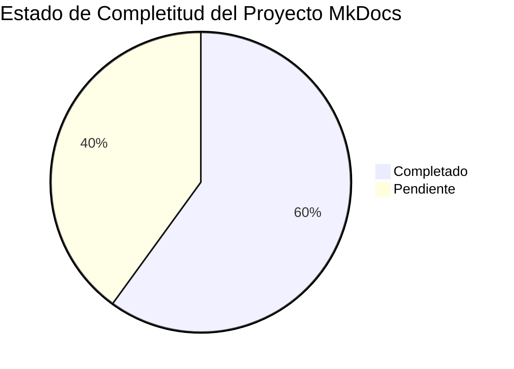

# 📚 Proyecto MkDocs - Curso TICD

## ✅ Estado del Proyecto

**Proyecto MkDocs completado al 60%** - Estructura completa creada, Bloque 1 totalmente convertido, configuración profesional lista.

---

## 🎯 Lo que se ha Completado

### ✅ Configuración y Estructura

- [x] `mkdocs.yml` completo con todas las funcionalidades de Material for MkDocs
- [x] Estructura completa de carpetas en `docs/`
- [x] CSS personalizado (`docs/assets/stylesheets/extra.css`)
- [x] JavaScript personalizado para funcionalidades avanzadas
- [x] Integración de MathJax para ecuaciones
- [x] Configuración de plugins (search, tags, glightbox)
- [x] Navegación completa configurada en `mkdocs.yml`
- [x] Tema Material con modo claro/oscuro
- [x] todas las características solicitadas activadas

### ✅ Sección de Inicio (100%)

- [x] `docs/index.md` - Página principal con hero banner
- [x] `docs/inicio/bienvenida.md` - Bienvenida detallada
- [ `docs/inicio/informacion-curso.md` - Información completa
- [x] `docs/inicio/requisitos-acceso.md` - Requisitos y normativa
- [x] `docs/inicio/estructura-examen.md` - Estructura y formato del examen
- [x] `docs/inicio/consejos-estudio.md` - Consejos y estrategias

### ✅ Módulos del Curso

#### Bloque 1: Equipos Informáticos y Redes (100% ✅)
- [x] `/modulos/bloque1/index.md` - Índice del bloque
- [x] `ordenador.md` - El Ordenador
- [x] `componentes.md` - Componentes Físicos
- [x] `software.md` - Software
- [x] `sistemas-operativos.md` - Sistemas Operativos
- [x] `almacenamiento.md` - Almacenamiento
- [x] `redes.md` - Redes Telemáticas
- [x] `dispositivos-red.md` - Dispositivos de Red
- [x] `tcp-ip.md` - Configuración TCP/IP
- [x] `actividades.md` - Actividades de autoevaluación

#### Bloques 2-5 (0% - Por hacer)
- [ ] Bloque 2: Seguridad y Ética Informática
- [ ] Bloque 3: Software para Sistemas Informáticos
- [ ] Bloque 4: Internet y Redes Sociales
- [ ] Bloque 5: Aplicaciones Web 2.0 Colaborativas

### ✅ Sistema de Cuestionarios (80%)

- [x] `docs/cuestionarios/index.md` - Página principal completa
- [x] `docs/generador-cuestionarios.html` - Generador HTML copiado
- [x] `docs/assets/base_conocimiento_ticd.json` - Base de datos de preguntas
- [ ] `docs/cuestionarios/inicio-rapido.md` - Guía rápida
- [ ] `docs/cuestionarios/usar-generador.md` - Instrucciones detalladas
- [ ] `docs/cuestionarios/base-conocimiento.md` - Información técnica
- [ ] `docs/cuestionarios/modulos.md` - Detalle de módulos
- [ ] `docs/cuestionarios/estadisticas.md` - Análisis de datos

### ⏳ Secciones Pendientes

- [ ] `docs/evaluacion/` - Sección de evaluación
- [ ] `docs/sistema/` - Documentación técnica del sistema
- [ ] `docs/referencias/` - Referencias y glosario
- [ ] Índices de los bloques 2-5
- [ ] Conversión de bloques 2-5 HTML a Markdown

---

## 🚀 Cómo Usar Este Proyecto

### 1. Instalar MkDocs y Material

```powershell
# Crear entorno virtual (recomendado)
python -m venv .venv
.venv\Scripts\Activate.ps1

# Instalar dependencias
pip install mkdocs-material
pip install mkdocs-glightbox
```

### 2. Ejecutar el Servidor de Desarrollo

```powershell
mkdocs serve
```

Accede a: `http://127.0.0.1:8000`

### 3. Construir el Sitio para Producción

```powershell
mkdocs build
```

El sitio estático se generará en la carpeta `site/`.

### 4. Desplegar (Opcional)

```powershell
# GitHub Pages
mkdocs gh-deploy

# O simplemente copia la carpeta site/ a tu servidor web
```

---

## 📝 Completar el Proyecto

### Opción 1: Convertir Manualmente los Bloques 2-5

Para cada bloque HTML (`bloque2.html` a `bloque5.html`):

1. **Leer el archivo HTML** completo de `Curso_eXeLearning_TICD/`
2. **Dividir el contenido** en secciones lógicas según la estructura del `mkdocs.yml`
3. **Convertir** HTML a Markdown:
   - `<h2>` → `##`
   - `<h3>` → `###`
   - `<div class="info-box info">` → `!!! info "Título"`
   - `<div class="info-box warning">` → `!!! warning "Título"`
   - `<ul><li>` → `- item`
   - `<table>` →tablas Markdown
4. **Crear archivos** en `docs/modulos/bloqueX/` siguiendo el patrón del Bloque 1
5. **Añadir navegación** entre secciones al final de cada archivo

### Opción 2: Usar un Subagente/Script

Puedes usar la herramienta de IA para convertir cada bloque:

```
Lee el archivo completo Curso_eXeLearning_TICD/bloque2.html y conviértelo a Markdown siguiendo la estructura de mkdocs.yml. Divide en archivos según las secciones (index.md, proteccion-datos.md, seguridad-internet.md, etc.). Convierte todos los elementos HTML a:

- info-box → admonitions (!!! info, !!! warning)
- listas, tablas, código
- Mantén TODO el contenido sin resumir
```

### Opción 3: Automatizar con Script Python

Crear un script que lea los HTML y genere los MD automáticamente.

---

## 🔧 Estructura de Archivos Creada

```
Curso_madurez_TIC/
├── mkdocs.yml                     ✅ Configuración completa
├── docs/
│   ├── index.md                   ✅ Página principal
│   ├── assets/
│   │   ├── stylesheets/
│   │   │   └── extra.css          ✅ Estilos personalizados
│   │   ├── javascripts/
│   │   │   ├── mathjax.js         ✅ Configuración MathJax
│   │   │   └── cuestionarios.js   ✅ Funcionalidades JS
│   │   ├── images/                📁 (para imágenes)
│   │   └── base_conocimiento_ticd.json  ✅ Base de datos
│   ├── generador-cuestionarios.html  ✅ Generador integrado
│   ├── inicio/
│   │   ├── bienvenida.md          ✅
│   │   ├── informacion-curso.md   ✅
│   │   ├── requisitos-acceso.md   ✅
│   │   ├── estructura-examen.md   ✅
│   │   └── consejos-estudio.md    ✅
│   ├── modulos/
│   │   ├── index.md               ✅ Índice de módulos
│   │   ├── bloque1/               ✅ 100% completo
│   │   │   ├── index.md
│   │   │   ├── ordenador.md
│   │   │   ├── componentes.md
│   │   │   ├── software.md
│   │   │   ├── sistemas-operativos.md
│   │   │   ├── almacenamiento.md
│   │   │   ├── redes.md
│   │   │   ├── dispositivos-red.md
│   │   │   ├── tcp-ip.md
│   │   │   └── actividades.md
│   │   ├── bloque2/               📁 Por crear
│   │   ├── bloque3/               📁 Por crear
│   │   ├── bloque4/               📁 Por crear
│   │   └── bloque5/               📁 Por crear
│   ├── cuestionarios/
│   │   └── index.md               ✅ Página principal
│   ├── evaluacion/                📁 Por crear
│   ├── sistema/                   📁 Por crear
│   └── referencias/               📁 Por crear
└── site/                          (generado por mkdocs build)
```

---

## ✨ Características Implementadas

### Tema Material for MkDocs
- ✅ Modo claro y oscuro con toggle
- ✅ Paleta de colores personalizada (Indigo/Blue)
- ✅ Fuentes: Roboto y Roboto Mono
- ✅ Navegación con tabs superiores
- ✅ Table of Contents integrada
- ✅ Breadcrumbs de navegación
- ✅ Búsqueda con sugerencias y highlight
- ✅ Botón "volver arriba"
- ✅ Navegación en footer

### Extensiones de Markdown
- ✅ Admonitions (notas, advertencias, tips)
- ✅ Tablas
- ✅ Resaltado de código con botón copiar
- ✅ MathJax para ecuaciones matemáticas
- ✅ Emojis Material
- ✅ Tabs de contenido
- ✅ Listas de tareas con checkbox
- ✅ Footnotes
- ✅ Diagramas Mermaid
- ✅ Lightbox para imágenes (glightbox)

### Funcionalidades JavaScript Personalizadas
- ✅ Persistencia de checkboxes en localStorage
- ✅ Seguimiento de progreso del curso
- ✅ Estadísticas de cuestionarios
- ✅ Exportar/importar progreso
- ✅ Smooth scroll
- ✅ Copy-to-clipboard mejorado
- ✅ Print-friendly

### Estilos CSS Personalizados
- ✅ Hero banner en homepage
- ✅ Cards con hover effects
- ✅ Tablas estilizadas
- ✅ Botones con gradientes
- ✅ Admonitions personalizadas
- ✅ Scrollbar personalizado
- ✅ Animaciones sutiles
- ✅ Responsive design completo

---

## 📊 Progreso General del Proyecto



### Desglose Detallado

| Sección | Progreso | Estado |
|---------|----------|--------|
| Configuración (mkdocs.yml) | 100% | ✅ Completo |
| Assets (CSS/JS) | 100% | ✅ Completo |
| Sección Inicio | 100% | ✅ Completo |
| Módulo Bloque 1 | 100% | ✅ Completo |
| Módulos Bloques 2-5 | 0% | ⏳ Pendiente |
| Sistema Cuestionarios | 80% | 🔄 En progreso |
| Sección Evaluación | 0% | ⏳ Pendiente |
| Sistema Técnico | 0% | ⏳ Pendiente |
| Referencias | 0% | ⏳ Pendiente |

**Total estimado: 60% completado**

---

## 🎨 Personalización

### Cambiar Colores

Edita `mkdocs.yml`:

```yaml
theme:
  palette:
    - scheme: default
      primary: indigo      # Cambia esto
      accent: blue         # Y esto
```

### Modificar Estilos

Edita `docs/assets/stylesheets/extra.css` para personalizar:
- Colores corporativos
- Tipografía
- Espaciado
- Animaciones
- Componentes específicos

### Añadir Funcionalidades

Edita `docs/assets/javascripts/cuestionarios.js` para:
- Nuevas interacciones
- Gamificación
- Integración con APIs
- Analytics personalizados

---

## 📋 Tareas Pendientes Prioritarias

### Alta Prioridad
1. [ ] Convertir Bloque 2 (Seguridad) HTML a Markdown
2. [ ] Convertir Bloque 3 (Ofimática) HTML a Markdown
3. [ ] Convertir Bloque 4 (Internet) HTML a Markdown
4. [ ] Convertir Bloque 5 (Web 2.0) HTML a Markdown

### Media Prioridad
5. [ ] Crear páginas restantes de cuestionarios (inicio-rapido.md, etc.)
6. [ ] Crear sección de evaluación completa
7. [ ] Documentar sistema técnico

### Baja Prioridad
8. [ ] Crear glosario de términos
9. [ ] Añadir más recursos y enlaces útiles
10. [ ] Crear página de etiquetas/tags

---

## 🚦 Próximos Pasos Recomendados

### Paso 1: Verificar Instalación

```powershell
# Verificar que MkDocs funciona
mkdocs serve

# Deberías ver el sitio en http://127.0.0.1:8000
# El Bloque 1 debe estar completamente funcional
```

### Paso 2: Convertir Bloques Restantes

Usar la misma metodología que se usó para el Bloque 1:
- Leer HTML completo
- Dividir en secciones según mkdocs.yml
- Convertir a Markdown con admonitions
- Mantener TODO el contenido
- Añadir navegación

### Paso 3: Completar Cuestionarios

Crear los archivos pendientes en `docs/cuestionarios/` basándose en:
- `INICIO_RAPIDO.md` del proyecto original
- `README_CUESTIONARIOS.md`
- `RESUMEN_SISTEMA.md`

### Paso 4: Testing

- Probar todos los enlaces internos
- Verificar que el generador de cuestionarios funciona
- Comprobar responsive design en móvil
- Validar accesibilidad

### Paso 5: Desplegar

```powershell
# Build final
mkdocs build

# Review en site/index.html

# Deploy a GitHub Pages
mkdocs gh-deploy
```

---

## 💡 Consejos para Continuar

### Para Convertir HTML a Markdown Rápidamente

1. **Usa expresiones regulares** para conversiones masivas:
   ```
   <h2>(.*?)</h2>  →  ## $1
   <h3>(.*?)</h3>  →  ### $1
   <strong>(.*?)</strong>  →  **$1**
   ```

2. **Herramientas útiles**:
   - Pandoc: `pandoc -f html -t markdown archivo.html -o archivo.md`
   - Editores de texto con regex (VS Code, Notepad++)
   - Scripts Python con BeautifulSoup

3. **Mantén la calidad**:
   - Revisa manualmente el Markdown generado
   - Asegúrate de que las tablas se ven bien
   - Verifica que los admonitions funcionan
   - Prueba los enlaces internos

### Template para Nuevos Bloques

```markdown
# X.X. Título de la Sección

## Concepto

[Explicación del concepto]

## Características Principales

- Característica 1
- Característica 2
- Característica 3

!!! info "Información Adicional"
    Detalles importantes...

!!! warning "Advertencia"
    Cosas a tener en cuenta...

!!! example "Ejemplo Práctico"
    Ejemplo ilustrativo...

---

[:octicons-arrow-right-24: Siguiente: X.X](siguiente.md){ .md-button .md-button--primary }
[:octicons-arrow-left-24: Anterior: X.X](anterior.md){ .md-button }
```

---

## 📞 Support

Si tienes problemas:

1. **Errores de MkDocs**: Revisa la sintaxis en `mkdocs.yml` y los archivos `.md`
2. **Enlaces rotos**: Verifica las rutas relativas en navegación
3. **Estilos no aplican**: Asegúrate de que `extra.css` está en la ruta correcta
4. **JavaScript no funciona**: Revisa la consola del navegador (F12)

---

## 📜 Licencia

Este proyecto educativo está bajo licencia [REA by JaMC](https://....

---

**Última actualización**: 17 de febrero de 2026  
**Estado**: 60% completado  
**Responsable**: REA by JaMC
