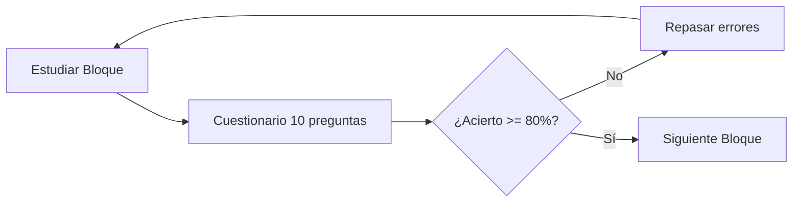

# 🎲 Sistema de Cuestionarios TICD

## 📚 Bienvenida al Sistema de Cuestionarios

El **Sistema de Cuestionarios TICD** es una herramienta interactiva diseñada para ayudarte a preparar el examen con preguntas reales de convocatorias anteriores (2016-2025).

---

## ✨ Características Principales

-   :material-check-circle:{ .lg .middle } __177 Preguntas Reales__

    ---

    Extraídas de exámenes oficiales de los últimos 10 años (2016-2025)

-   :material-school:{ .lg .middle } __Explicaciones Educativas__

    ---

    Cada respuesta incluye explicación detallada para que entiendas el concepto

-   :material-format-list-bulleted:{ .lg .middle } __10 Módulos Temáticos__

    ---

    Practica por temas específicos o mezcla todos los módulos

-   :material-chart-line:{ .lg .middle } __Estadísticas en Tiempo Real__

    ---

    Visualiza tu progreso y áreas de mejora instantáneamente

---

## 🎯 ¿Cómo Funciona?

### Paso 1: Selecciona el Módulo

Elige entre:

- **Todos los módulos** - Para práctica general
- **Hardware y Arquitectura** - Componentes, memoria, procesadores
- **Redes e Internet** - Protocolos, IP, tipos de redes
- **Seguridad Informática** - Malware, protección, LOPD
- **Software y Sistemas Operativos** - Windows, Linux, gestión
- **Ofimática** - Word, Excel, PowerPoint
- **Bases de Datos** - SGBD, claves, SQL básico
- **Multimedia** - Formatos de imagen, audio, vídeo
- **Web 2.0 y Redes Sociales** - Blogs, wikis, colaboración
- **Licencias y Derechos** - Creative Commons, copyright

### Paso 2: Configura tu Cuestionario

- Número de preguntas: **5 a 30** (recomendado: 10-15 para estudio, 30 para simulacro)
- Las preguntas se generan aleatoriamente cada vez

### Paso 3: Responde

- Lee cada pregunta cuidadosamente
- Selecciona una de las 4 opciones (a, b, c, d)
- Puedes cambiar tu respuesta antes de verificar

### Paso 4: Verifica y Aprende

- Al terminar, haz clic en "Verificar Respuestas"
- Verás:
    - ✅ Respuestas correctas en verde
    - ❌ Respuestas incorrectas en rojo
    - 💡 Explicación educativa de cada respuesta
    - 📊 Estadísticas: correctas, incorrectas, sin responder, % de acierto

### Paso 5: Repite y Mejora

- Analiza las explicaciones de las respuestas incorrectas
- Genera nuevos cuestionarios del mismo módulo para reforzar
- Cuando domines un módulo, pasa al siguiente

---

## 📊 Estadísticas de la Base de Conocimiento

### Distribución de Preguntas por Módulo

| Módulo | Núm. Preguntas | Porcentaje |
|--------|----------------|------------|
| 🌐 Redes e Internet | 42 | 23.7% |
| ❓ General | 41 | 23.2% |
| 💻 Hardware y Arquitectura | 38 | 21.5% |
| 📝 Ofimática | 28 | 15.8% |
| 🎬 Multimedia | 17 | 9.6% |
| ⚙️ Software y Sistemas Operativos | 14 | 7.9% |
| 🌍 Web 2.0 y Redes Sociales | 14 | 7.9% |
| 🔒 Seguridad Informática | 9 | 5.1% |
| 🗄️ Bases de Datos | 7 | 4.0% |
| ⚖️ Licencias y Derechos | 5 | 2.8% |

### Preguntas con Respuestas Verificadas

- **Total de preguntas:** 177
- **Con respuestas correctas verificadas:** 60 (33.9%)
- **Con explicaciones educativas:** 177 (100%)
- **Años cubiertos:** 2016, 2017, 2018, 2019, 2023, 2025

---

## 🚀 Acceder al Generador

!!! success "Listo para Empezar"
    El generador de cuestionarios es una aplicación web standalone que funciona completamente en tu navegador. No requiere conexión a internet una vez cargada.
    
    **Opciones para usar el generador:**
    
    1. **Abrir directamente el HTML** (recomendado para uso offline)
       - Archivo: `/generador_cuestionarios.html`
       - Simplemente haz doble clic para abrirlo en tu navegador
    
    2. **A través de esta documentación** (si estás usando MkDocs serve)
       - [Abrir Generador de Cuestionarios](../generador-cuestionarios.html){ .md-button .md-button--primary target="_blank" }

---

## 💡 Consejos de Uso

### Para Estudio Inicial

!!! tip "Cuando estés aprendiendo"
    - Usa **10-15 preguntas** por sesión
    - Selecciona **módulos específicos** relacionados con el bloque que estés estudiando
    - Lee **todas las explicaciones**, incluso de las respuestas correctas
    - **Repite** el mismo módulo si tienes menos del 80% de acierto
    - No tengas prisa, el objetivo es aprender

### Para Repaso

!!! example "Cuando estés repasando"
    - Usa **15-20 preguntas** por sesión
    - Mezcla **2-3 módulos** relacionados
    - Enfócate en módulos donde tuviste más errores
    - Intenta mejorar tu tiempo de respuesta
    - Objetivo: 85%+ de acierto

### Para Simulacros

!!! warning "Simulación de examen real"
    - Usa **30 preguntas** (igual que el examen)
    - Selecciona **"Todos los módulos"**
    - **Cronométrate: 45 minutos** máximo
    - Simula condiciones reales (sin apuntes, sin distracciones)
    - Objetivo: 90%+ de acierto y terminar en tiempo

---

## 📈 Estrategia de Práctica Recomendada

### Fase 1: Aprendizaje (Semanas 1-6)

- Practica **después de estudiar** cada bloque
- Usa **módulos específicos**
- **10-15 preguntas** por sesión
- Mínimo **2 sesiones por módulo**

### Fase 2: Consolidación (Semana 7)

- **20 preguntas** por sesión
- **Mezcla de módulos**
- **2 sesiones diarias**
- Refuerza áreas débiles

### Fase 3: Simulación (Semana 8)

- **30 preguntas** (examen completo)
- **Todos los módulos**
- **45 minutos** cronometrados
- **1 simulacro diario**
- Objetivo: **90%+ de acierto**

---

## 📊 Registro de Progreso

Lleva un registro de tus sesiones de práctica:

| Fecha | Módulo(s) | Preguntas | Correctas | % Acierto | Tiempo | Notas |
|-------|-----------|-----------|-----------|-----------|---------|-------|
| __ / __ | _________ | ___ | ___ | ___% | ___ min | ______________ |
| __ / __ | _________ | ___ | ___ | ___% | ___ min | ______________ |
| __ / __ | _________ | ___ | ___ | ___% | ___ min | ______________ |

!!! tip "Análisis de Progreso"
    - Si un módulo está **por debajo del 70%**: Repasa ese bloque teórico
    - Si un módulo está **entre 70-80%**: Práctica más cuestionarios de ese módulo
    - Si un módulo está **por encima del 85%**: ¡Bien! Mantén con repasos esporádicos

---

## ❓ Preguntas Frecuentes

??? question "¿Las preguntas son las mismas que saldrán en el examen?"
    No exactamente. Son preguntas de exámenes anteriores (2016-2025). Sirven para practicar el tipo de preguntas y conceptos que suelen aparecer, pero el examen real tendrá preguntas diferentes.

??? question "¿Cuántas preguntas debo practicar antes del examen?"
    Recomendamos practicar al menos **100-150 preguntas** en total, distribuidasentre todos los módulos. Lo ideal es hacer varios cuestionarios de cada módulo hasta dominarlos.

??? question "¿Qué hago si suspendo muchos cuestionarios?"
    No te desanimes. Los cuestionarios son para aprender. Si fallas mucho:
    - Vuelve a estudiar el bloque teórico correspondiente
    - Lee cuidadosamente las explicaciones
    - Busca información adicional sobre conceptos que no entiendas
    - Repite el cuestionario después de repasar

??? question "¿Puedo usar el generador sin internet?"
    Sí, una vez que descargues el archivo HTML y el JSON de la base de conocimiento, funciona completamente offline.

??? question "¿Por qué algunas preguntas no tienen respuesta verificada?"
    Algunas preguntas de años 2018, 2019 y 2023 no tienen respuesta verificada porque los PDFs de soluciones tenían un formato diferente que dificultó la extracción automática. Aun así, todas tienen explicaciones educativas.

---

## 🔗 Enlaces Rápidos

- [Inicio Rápido](inicio-rapido.md) - Guía rápida para empezar
- [Usar el Generador](usar-generador.md) - Instrucciones detalladas
- [Base de Conocimiento](base-conocimiento.md) - Información técnica sobre las preguntas
- [Módulos Disponibles](modulos.md) - Detalle de cada módulo temático
- [Estadísticas](estadisticas.md) - Análisis completo de la base de datos

---

[:octicons-arrow-right-24: Inicio Rápido](inicio-rapido.md){ .md-button .md-button--primary }
[:octicons-arrow-right-24: Abrir Generador](../generador-cuestionarios.html){ .md-button target="_blank" }

---

**REA by JaMC** | Sistema de Cuestionarios v2.0
