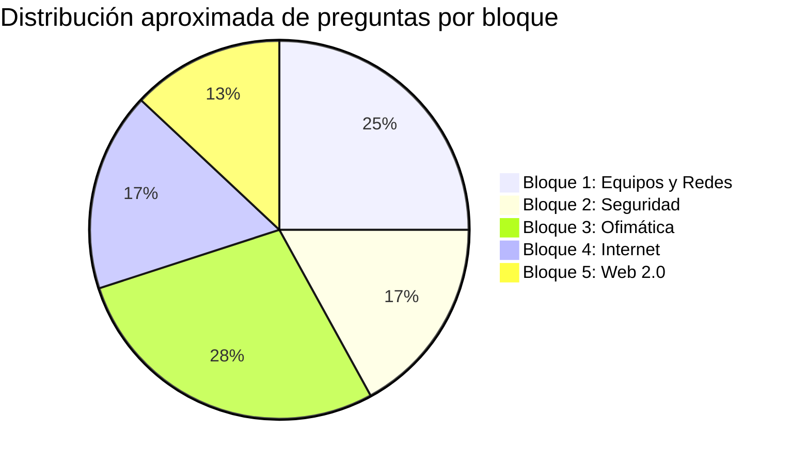

# Módulos del Curso TICD

## 📚 Contenidos del Curso

El curso de **Tratamiento de la Información y Competencia Digital** se estructura en **5 bloques temáticos** que cubren de forma completa el currículo oficial para las Pruebas de Acceso a Ciclos Formativos de Grado Superior.

---

## Estructura de los Módulos

-   :fontawesome-solid-computer:{ .lg .middle } __[Bloque 1: Equipos Informáticos y Redes](bloque1/index.md)__

    ---

    **Contenidos:**
    
    - Concepto y funciones del ordenador
    - Componentes hardware (CPU, RAM, almacenamiento)
    - Software y sistemas operativos
    - Unidades de almacenamiento
    - Redes telemáticas (PAN, LAN, MAN, WAN)
    - Dispositivos de red (router, switch, hub)
    - Configuración TCP/IP
    
    **Preguntas estimadas en examen:** 6-8 preguntas

    [:octicons-arrow-right-24: Acceder al Bloque 1](bloque1/index.md)

-   :fontawesome-solid-shield-halved:{ .lg .middle } __[Bloque 2: Seguridad y Ética Informática](bloque2/index.md)__

    ---

    **Contenidos:**
    
    - LOPD y RGPD (protección de datos)
    - Copias de seguridad
    - Malware (virus, troyanos, ransomware)
    - Phishing y amenazas online
    - Medidas de protección
    - Licencias de software
    - Propiedad intelectual
    
    **Preguntas estimadas en examen:** 4-6 preguntas

    [:octicons-arrow-right-24: Acceder al Bloque 2](bloque2/index.md)

-   :fontawesome-solid-table:{ .lg .middle } __[Bloque 3: Software para Sistemas Informáticos](bloque3/index.md)__

    ---

    **Contenidos:**
    
    - Procesadores de texto (Word, Writer)
    - Hojas de cálculo (Excel, funciones)
    - Bases de datos (SGBD, claves)
    - Presentaciones (PowerPoint, Impress)
    - Edición multimedia (imagen, audio, vídeo)
    
    **Preguntas estimadas en examen:** 8-9 preguntas

    [:octicons-arrow-right-24: Acceder al Bloque 3](bloque3/index.md)

-   :fontawesome-solid-globe:{ .lg .middle } __[Bloque 4: Internet y Redes Sociales](bloque4/index.md)__

    ---

    **Contenidos:**
    
    - Servicios de internet (HTTP, FTP, DNS)
    - Buscadores y búsqueda avanzada
    - Evolución de la web (1.0, 2.0, 3.0)
    - Redes sociales
    - Identidad digital
    - Netiqueta y uso responsable
    
    **Preguntas estimadas en examen:** 4-6 preguntas

    [:octicons-arrow-right-24: Acceder al Bloque 4](bloque4/index.md)

-   :fontawesome-solid-users:{ .lg .middle } __[Bloque 5: Aplicaciones Web 2.0 Colaborativas](bloque5/index.md)__

    ---

    **Contenidos:**
    
    - Herramientas colaborativas
    - Blogs, wikis y foros
    - Almacenamiento en la nube
    - Documentos colaborativos
    - Accesibilidad web (WAI, WCAG)
    
    **Preguntas estimadas en examen:** 3-5 preguntas

    [:octicons-arrow-right-24: Acceder al Bloque 5](bloque5/index.md)

---

## 📊 Peso de cada Bloque en el Examen

Basándose en exámenes de años anteriores:

!!! tip "Recomendación de Estudio"
    Aunque el Bloque 3 (Ofimática) tiene más peso, **no descuides ningún bloque**. Preguntas de todos los bloques aparecen en el examen y son relativamente fáciles de dominar con práctica.

---

## 🎯 Orden de Estudio Recomendado

### Ruta Lineal (Recomendada para principiantes)
1. **Bloque 1** → Fundamentos necesarios para entender el resto
2. **Bloque 2** → Seguridad, importante conocer cuanto antes
3. **Bloque 3** → El más extenso, dedícale tiempo
4. **Bloque 4** → Internet y redes sociales
5. **Bloque 5** → Web 2.0 y colaboración

### Ruta por Dificultad
1. **Bloque 4 o 5** → Empezar por lo más familiar
2. **Bloque 2** → Seguridad, conceptualmente sencillo
3. **Bloque 1** → Hardware y redes, algo más técnico
4. **Bloque 3** → Ofimática, requiere práctica de funciones

### Ruta por Relevancia en el Examen
1. **Bloque 3** → Más preguntas (28%)
2. **Bloque 1** → Segunda prioridad (25%)
3. **Bloque 2 y 4** → Tercera prioridad (17% cada uno)
4. **Bloque 5** → Cuarta prioridad (13%)

---

## ✅ Checklist de Progreso

Marca tu progreso conforme avanzas:

### Bloque 1: Equipos Informáticos y Redes
- [ ] 1.1. El Ordenador
- [ ] 1.2. Componentes Físicos
- [ ] 1.3. Software
- [ ] 1.4. Sistemas Operativos
- [ ] 1.5. Almacenamiento
- [ ] 1.6. Redes Telemáticas
- [ ] 1.7. Dispositivos de Red
- [ ] 1.8. Configuración TCP/IP
- [ ] Actividades completadas
- [ ] Cuestionario (80%+ acierto)

### Bloque 2: Seguridad y Ética
- [ ] 2.1. Protección de Datos
- [ ] 2.2. Seguridad en Internet
- [ ] 2.3. Malware y Amenazas
- [ ] 2.4. Estrategias de Prevención
- [ ] 2.5. Propiedad Intelectual
- [ ] 2.6. Licencias de Software
- [ ] Actividades completadas
- [ ] Cuestionario (80%+ acierto)

### Bloque 3: Software Ofimático
- [ ] 3.1. Procesadores de Texto
- [ ] 3.2. Hojas de Cálculo
- [ ] 3.3. Bases de Datos
- [ ] 3.4. Presentaciones
- [ ] 3.5. Edición Multimedia
- [ ] Actividades completadas
- [ ] Cuestionario (80%+ acierto)

### Bloque 4: Internet y Redes Sociales
- [ ] 4.1. Servicios de Internet
- [ ] 4.2. Evolución de la Web
- [ ] 4.3. Redes Sociales
- [ ] 4.4. Identidad Digital
- [ ] 4.5. Uso Responsable
- [ ] Actividades completadas
- [ ] Cuestionario (80%+ acierto)

### Bloque 5: Web 2.0 Colaborativa
- [ ] 5.1. Herramientas Colaborativas
- [ ] 5.2. Blogs y Wikis
- [ ] 5.3. Almacenamiento en la Nube
- [ ] 5.4. Documentos Colaborativos
- [ ] 5.5. Accesibilidad Web
- [ ] Actividades completadas
- [ ] Cuestionario (80%+ acierto)

---

## 📈 Seguimiento de Tu Progreso

Registra tu avance y puntuaciones:

| Bloque | Fecha Inicio | Fecha Fin | Cuestionario 1 | Cuestionario 2 | Cuestionario Final | Estado |
|--------|--------------|-----------|----------------|----------------|-------------------|---------|
| Bloque 1 | __ / __ / __ | __ / __ / __ | __% | __% | __% | ⬜ |
| Bloque 2 | __ / __ / __ | __ / __ / __ | __% | __% | __% | ⬜ |
| Bloque 3 | __ / __ / __ | __ / __ / __ | __% | __% | __% | ⬜ |
| Bloque 4 | __ / __ / __ | __ / __ / __ | __% | __% | __% | ⬜ |
| Bloque 5 | __ / __ / __ | __ / __ / __ | __% | __% | __% | ⬜ |

!!! success "Objetivo"
    Alcanzar **85%+ de acierto** en todos los bloques antes del examen.

---

[:octicons-arrow-right-24: Comenzar con Bloque 1](bloque1/index.md){ .md-button .md-button--primary }
[:octicons-arrow-right-24: Ir a Cuestionarios](../cuestionarios/index.md){ .md-button }

---

**REA by JaMC** | FPA Miguel Hernández
